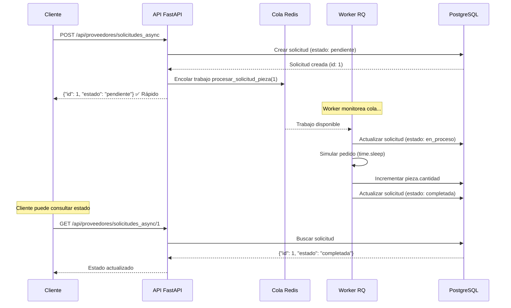

# 🔄 Sistema de Colas (Redis + RQ)

## Introducción

El sistema utiliza **colas de trabajo** para procesar tareas que requieren tiempo sin bloquear la API. Esto permite que la API responda inmediatamente mientras los workers procesan las tareas en background.

## ¿Por qué usar colas?

### Problema sin colas

```python
@router.post("/proveedores/solicitudes")
def solicitar_piezas(pieza_id, cantidad):
    # Simular pedido a proveedor (5 segundos)
    time.sleep(5)  # ❌ API bloqueada 5 segundos
    pieza.cantidad += cantidad
    return {"mensaje": "Pieza solicitada"}
```

**Consecuencias:**
- ❌ Cliente espera 5 segundos
- ❌ API no puede atender otros requests
- ❌ No escalable (1 request lento bloquea todo)

### Solución con colas

```python
@router.post("/proveedores/solicitudes_async")
def solicitar_piezas_async(pieza_id, cantidad):
    solicitud = crear_solicitud(pieza_id, cantidad)
    queue.enqueue(procesar_solicitud_pieza, solicitud.id)
    return {"id": solicitud.id, "estado": "pendiente"}  # ✅ Respuesta inmediata
```

**Beneficios:**
- ✅ API responde en ~50ms
- ✅ Worker procesa en background
- ✅ Cliente puede consultar estado después
- ✅ Sistema escalable

## ¿Qué es RQ?

**RQ (Redis Queue)** es una biblioteca Python para ejecutar trabajos (jobs) en background usando Redis como broker.

### Componentes:

1. **Producer (Productor)**: Código que encola trabajos → **API FastAPI**
2. **Queue (Cola)**: Almacena trabajos pendientes → **Redis**
3. **Consumer (Consumidor)**: Procesa trabajos → **Worker RQ**
4. **Job (Trabajo)**: Función Python + argumentos

```
Producer → Queue → Consumer
  (API)    (Redis)  (Worker)
```

## Arquitectura del Sistema de Colas



## Configuración en Docker Compose

### docker-compose.yml

```yaml
services:
  # API: Produce trabajos
  api:
    build: .
    command: uvicorn main:app --host 0.0.0.0 --port 5000
    ports:
      - "5050:5000"
    depends_on:
      - redis

  # Worker: Consume trabajos
  worker:
    build: .
    command: rq worker --url redis://redis:6379/0 default
    depends_on:
      - redis
      - api

  # Redis: Cola de mensajes
  redis:
    image: redis:7-alpine
    ports:
      - "6379:6379"
```

**Puntos clave:**
- `api` y `worker` usan la misma imagen (mismo código)
- `worker` ejecuta comando `rq worker` en lugar de `uvicorn`
- Ambos se conectan a Redis en `redis://redis:6379/0`
- Cola: `default`

## Implementación en el Proyecto

### 1. Configuración de Redis y Cola

**Archivo:** `app/tasks.py`

```python
import redis
from rq import Queue

# Conexión a Redis
redis_url = os.getenv("REDIS_URL", "redis://redis:6379/0")
redis_conn = redis.from_url(redis_url)

# Cola default
queue = Queue(connection=redis_conn)
```

### 2. Definición de Workers

**Archivo:** `app/tasks.py`

#### Worker 1: Procesar Solicitud de Pieza

```python
def procesar_solicitud_pieza(solicitud_id: int) -> None:
    """
    Worker que simula pedido a proveedor y actualiza inventario.
    
    Flujo:
    1. Cambiar estado a "en_proceso"
    2. Obtener tiempo de entrega del proveedor
    3. Simular espera (time.sleep)
    4. Incrementar cantidad de pieza
    5. Cambiar estado a "completada"
    """
    session = _ensure_session()
    try:
        # 1. Obtener solicitud
        solicitudes_service = SolicitudesPiezaService(session)
        solicitud = solicitudes_service.retrieve(solicitud_id)
        
        # 2. Cambiar a "en_proceso"
        solicitud.estado = "en_proceso"
        session.commit()
        
        # 3. Obtener tiempo de proveedor
        pieza = piezas_service.retrieve(solicitud.id_pieza)
        proveedor = proveedores_service.retrieve(pieza.id_proveedor)
        tiempo = proveedor.tiempo
        solicitud.tiempo_estimado = tiempo
        session.commit()
        
        # 4. Simular pedido (máx 1 segundo para testing)
        time.sleep(min(tiempo, 1))
        
        # 5. Actualizar inventario
        pieza.cantidad += solicitud.cantidad
        solicitud.estado = "completada"
        session.commit()
    finally:
        session.close()
```

#### Worker 2: Procesar Orden de Fabricación

```python
def procesar_orden_fabricacion(orden_id: int) -> None:
    """
    Worker que consume piezas después de confirmación con fábrica.
    
    Flujo:
    1. Verificar que orden esté "confirmado"
    2. Cambiar estado a "consumiendo_piezas"
    3. Obtener plan de materiales
    4. Consumir cada pieza del inventario
    5. Cambiar estado a "esperando_fabricacion"
    """
    session = _ensure_session()
    try:
        ordenes_service = OrdenesFabricacionService(session)
        orden = ordenes_service.retrieve(orden_id)
        
        # 1. Validar estado
        if orden.estado == "confirmado":
            # 2. Cambiar estado
            orden.estado = "consumiendo_piezas"
            session.commit()
            
            # 3. Obtener plan
            plan = fabricacion_service.solicitar_plan(
                orden.id_producto, orden.cantidad
            )
            
            # 4. Consumir piezas
            for material in plan.materiales:
                pieza = piezas_repo.get_by_id(material["id_pieza"])
                if pieza:
                    pieza.cantidad -= material["cantidad"]
                    print(f"[WORKER] Consumido {material['cantidad']} x {material['id_pieza']}")
            
            session.commit()
            
            # 5. Esperar productos de fábrica
            orden.estado = "esperando_fabricacion"
            session.commit()
            print(f"[WORKER] ⏳ Esperando productos de fábrica")
    except Exception as exc:
        orden.estado = "fallida"
        orden.detalle = {"error": str(exc)}
        session.commit()
    finally:
        session.close()
```

### 3. Encolar Trabajos desde la API

#### Ejemplo 1: Solicitud de Pieza Asíncrona

**Archivo:** `app/api/proveedores_controller.py`

```python
from app.tasks import queue, procesar_solicitud_pieza

@router.post("/solicitudes_async", status_code=202)
def solicitar_piezas_async(body: SolicitudPiezaAsync, db: Session = Depends(get_db)):
    # 1. Crear registro en DB
    solicitudes_service = SolicitudesPiezaService(db)
    solicitud = solicitudes_service.create({
        "id_pieza": body.id_pieza,
        "cantidad": body.cantidad,
        "estado": "pendiente"
    })
    
    # 2. Encolar trabajo
    queue.enqueue(procesar_solicitud_pieza, solicitud.id)
    
    # 3. Responder inmediatamente
    return {
        "id": solicitud.id,
        "estado": solicitud.estado,
        "tiempo_estimado": solicitud.tiempo_estimado
    }
```

**HTTP Status:** `202 Accepted` indica procesamiento asíncrono.

#### Ejemplo 2: Orden de Fabricación

**Archivo:** `app/services/fabricacion/fabricacion_orchestrator.py`

```python
from app.tasks import queue, procesar_orden_fabricacion

class FabricacionOrchestrator:
    def crear_orden(self, codigo: str, cantidad: int) -> dict:
        # ... (calcular piezas, solicitar proveedores)
        
        # Confirmar con fábrica externa
        confirmacion = self.fabricacion_service.confirmar_fabricacion_externa(
            codigo, cantidad
        )
        
        if confirmacion and confirmacion.get("status") == "ok":
            orden.estado = "confirmado"
            session.commit()
            
            # Encolar worker para consumir piezas
            queue.enqueue(procesar_orden_fabricacion, orden.id)
            
            return {"id": orden.id, "estado": "confirmado"}
```

## Ciclo de Vida de un Trabajo

### Estados de un Job en RQ

```
Enqueued → Started → Finished
  (Cola)    (Worker)  (Exitoso)
                ↓
             Failed
           (Con error)
```

### Estados de Solicitud en nuestra DB

```
pendiente → en_proceso → completada
                      ↘ fallida
```

**Sincronización:**
- RQ maneja estado del job (enqueued/started/finished)
- Nuestra app maneja estado del negocio (pendiente/en_proceso/completada)

## Ejemplo Completo: Solicitud Asíncrona

### 1. Cliente hace request

```bash
curl -X POST http://localhost:5050/api/proveedores/solicitudes_async \
  -H "Content-Type: application/json" \
  -d '{"id_pieza": 1, "cantidad": 100}'
```

### 2. API responde inmediatamente

```json
{
  "id": 5,
  "estado": "pendiente",
  "tiempo_estimado": 0
}
```

**Tiempo:** ~50ms

### 3. Worker procesa en background

```
[WORKER] Procesando solicitud #5
[WORKER] Cambiando estado a "en_proceso"
[WORKER] Tiempo de proveedor: 5 minutos
[WORKER] Simulando pedido... (esperando 1 seg)
[WORKER] Incrementando pieza #1: +100 unidades
[WORKER] Solicitud #5 completada ✓
```

**Tiempo:** ~1-5 segundos (dependiendo del proveedor)

### 4. Cliente consulta estado

```bash
curl http://localhost:5050/api/proveedores/solicitudes_async/5
```

```json
{
  "id": 5,
  "id_pieza": 1,
  "cantidad": 100,
  "estado": "completada",
  "tiempo_estimado": 5
}
```

## Monitoreo de Colas

### Ver trabajos en cola (Redis CLI)

```bash
# Entrar al contenedor Redis
docker compose exec redis redis-cli

# Ver cantidad de trabajos en cola
> LLEN rq:queue:default
(integer) 3

# Ver trabajos encolados
> LRANGE rq:queue:default 0 -1

# Ver keys relacionadas a RQ
> KEYS rq:*
1) "rq:queue:default"
2) "rq:job:abc123"
3) "rq:workers"
```

### Ver logs de workers

```bash
# Logs en tiempo real
docker compose logs -f worker

# Filtrar por worker
docker compose logs -f worker | grep WORKER

# Últimos 50 logs
docker compose logs --tail=50 worker
```

### Inspeccionar estado de trabajos en Python

```python
from rq import Queue
from rq.job import Job
import redis

redis_conn = redis.from_url("redis://redis:6379/0")
queue = Queue(connection=redis_conn)

# Ver trabajos en cola
jobs = queue.jobs
print(f"Trabajos en cola: {len(jobs)}")

# Ver detalles de un job
job = Job.fetch('job_id', connection=redis_conn)
print(f"Estado: {job.get_status()}")
print(f"Resultado: {job.result}")
```

## Escalabilidad de Workers

### Escalar horizontalmente

```yaml
# docker-compose.yml
services:
  worker:
    build: .
    command: rq worker --url redis://redis:6379/0 default
    deploy:
      replicas: 5  # 5 workers en paralelo
```

**Ventajas:**
- 5 solicitudes procesadas simultáneamente
- Throughput 5x mayor
- Tolerancia a fallos (un worker cae, otros siguen)

### Ver workers activos

```bash
docker compose exec redis redis-cli

> SMEMBERS rq:workers
1) "rq:worker:abc-123"
2) "rq:worker:def-456"
3) "rq:worker:ghi-789"
```

## Gestión de Errores

### En el Worker

```python
def procesar_solicitud_pieza(solicitud_id: int) -> None:
    session = _ensure_session()
    try:
        # Procesamiento normal
        solicitud.estado = "completada"
        session.commit()
    except Exception as exc:
        # Marcar como fallida
        solicitud.estado = "fallida"
        solicitud.detalle = {"error": str(exc)}
        session.commit()
        # Re-raise para que RQ registre el fallo
        raise
    finally:
        session.close()
```

### Reintentos en RQ

```python
# Encolar con reintentos
queue.enqueue(
    procesar_solicitud_pieza,
    solicitud.id,
    retry=Retry(max=3, interval=[10, 30, 60])  # 3 reintentos
)
```

## Comparación: Síncrono vs Asíncrono

| Característica | Síncrono | Asíncrono (con cola) |
|----------------|----------|----------------------|
| **Endpoint** | `/proveedores/solicitudes` | `/proveedores/solicitudes_async` |
| **Tiempo de respuesta** | 5+ segundos | ~50ms |
| **Procesamiento** | Inmediato | En background |
| **Estado final** | En la respuesta | Consultar después |
| **Escalabilidad** | Limitada | Alta |
| **Complejidad** | Baja | Media |
| **Uso recomendado** | Operaciones rápidas | Operaciones lentas |

## Buenas Prácticas

### ✅ DO

1. **Usar colas para tareas lentas**
   ```python
   # Tarea que toma 5+ segundos
   queue.enqueue(procesar_solicitud_pieza, solicitud_id)
   ```

2. **Registrar estado antes de encolar**
   ```python
   solicitud = crear_solicitud(...)  # Estado: "pendiente"
   queue.enqueue(procesar_solicitud_pieza, solicitud.id)
   ```

3. **Manejar errores en workers**
   ```python
   try:
       # Procesamiento
   except Exception:
       marcar_como_fallida()
       raise
   ```

4. **Cerrar sesiones de DB**
   ```python
   try:
       # Usar sesión
   finally:
       session.close()
   ```

### ❌ DON'T

1. **No usar colas para tareas rápidas**
   ```python
   # ❌ Overhead innecesario
   queue.enqueue(sumar, 1, 2)
   ```

2. **No bloquear el worker**
   ```python
   # ❌ Worker bloqueado indefinidamente
   while True:
       time.sleep(1)
   ```

3. **No compartir sesiones entre API y Worker**
   ```python
   # ❌ Sesión de API no es válida en Worker
   queue.enqueue(funcion, session=db)
   ```

4. **No asumir orden de ejecución**
   ```python
   # ❌ No garantizado
   queue.enqueue(tarea1, id)
   queue.enqueue(tarea2, id)  # Puede ejecutarse antes que tarea1
   ```

## Ventajas del Sistema

### Para el Cliente
- ✅ Respuestas rápidas (no espera tareas lentas)
- ✅ Puede consultar estado cuando quiera
- ✅ Mejor experiencia de usuario

### Para el Sistema
- ✅ API no bloqueada
- ✅ Escalabilidad horizontal (agregar workers)
- ✅ Tolerancia a fallos (reintentos)
- ✅ Separación de responsabilidades

### Para Desarrollo
- ✅ Lógica de negocio desacoplada
- ✅ Testing más fácil (mockear colas)
- ✅ Monitoreo independiente

## Siguientes Pasos

Ahora que entiendes el sistema de colas:

1. **Aprende sobre concurrencia:** Lee [03_PARALELISMO_CONCURRENCIA.md](03_PARALELISMO_CONCURRENCIA.md)
2. **Ve flujos completos:** Lee [04_FLUJOS_INVENTARIO.md](04_FLUJOS_INVENTARIO.md)
3. **Crea tu propio worker:** Lee [05_GUIA_DESARROLLO.md](05_GUIA_DESARROLLO.md)
