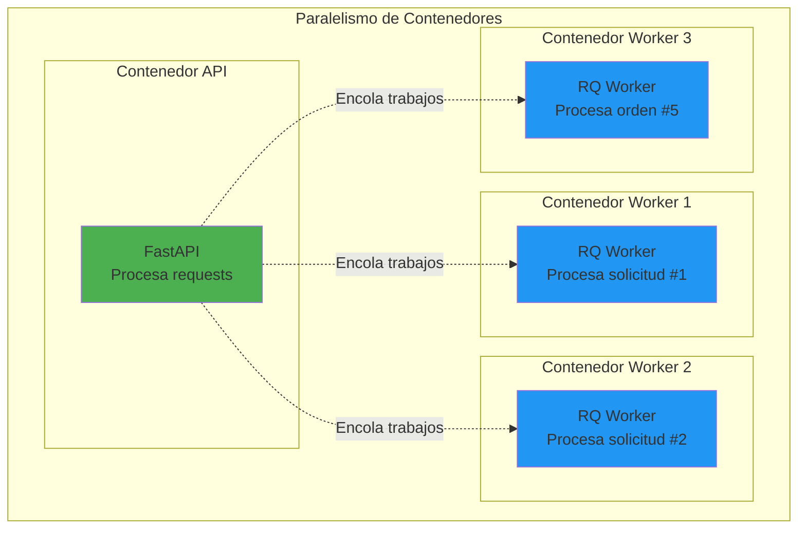
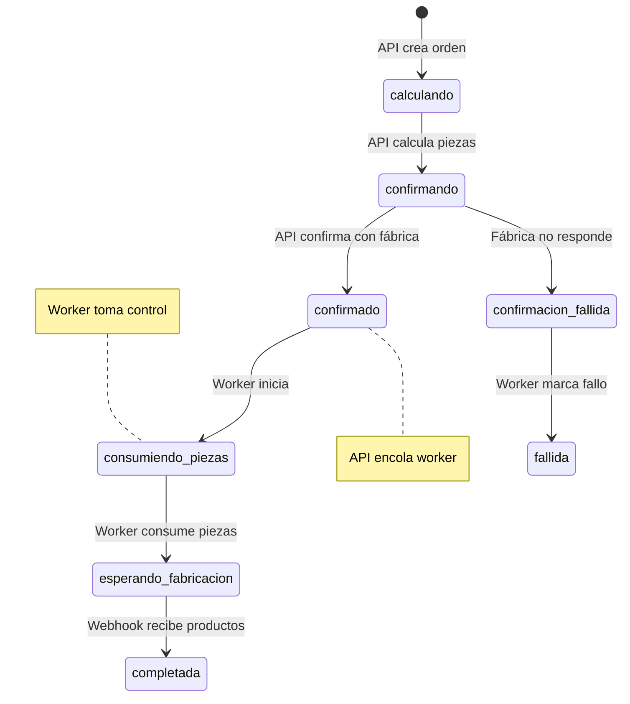

# ⚡ Paralelismo y Concurrencia

## Introducción

Este documento explica cómo el sistema maneja **múltiples tareas simultáneamente** usando paralelismo y concurrencia. Entender estos conceptos es clave para aprovechar la arquitectura del sistema.

## Diferencia: Paralelismo vs Concurrencia

### Concurrencia
> **Concurrencia** = Manejar múltiples tareas a la vez (pueden intercalarse)

**Analogía:** Un chef cocinando solo
- Pone agua a hervir
- Mientras hierve, pica vegetales
- Revisa el agua, luego vuelve a picar
- **Resultado:** Progreso en múltiples tareas, pero UNA a la vez

**En nuestro sistema:**
- FastAPI maneja múltiples requests (usa async/await)
- Workers RQ procesan múltiples trabajos (uno a la vez por worker)

### Paralelismo
> **Paralelismo** = Ejecutar múltiples tareas literalmente al mismo tiempo

**Analogía:** Tres chefs cocinando
- Chef 1: Hierve agua
- Chef 2: Pica vegetales
- Chef 3: Cocina carne
- **Resultado:** Tres tareas simultáneas REALES

**En nuestro sistema:**
- Contenedor API + Contenedor Worker ejecutan en paralelo
- Múltiples workers ejecutan trabajos en paralelo
- Múltiples requests a la API se procesan en paralelo

```
Concurrencia:  Task1 → Task2 → Task1 → Task3 (intercaladas)
Paralelismo:   Task1 ═══════════════════════
               Task2 ═══════════════════════  (simultáneas)
               Task3 ═══════════════════════
```

## Paralelismo en el Sistema

### Arquitectura Multi-Container



**Ejecución en paralelo:**
- API recibe y responde requests
- Worker 1 procesa solicitud de pieza P1
- Worker 2 procesa solicitud de pieza P2
- Worker 3 procesa orden de fabricación

**Todos al mismo tiempo** ✅

### Timeline de Ejecución Paralela

```
Tiempo →
0s    1s    2s    3s    4s    5s    6s

API     │ Request 1 │ Request 2 │ Request 3 │ Request 4 │
        │  (50ms)   │  (50ms)   │  (50ms)   │  (50ms)   │
        └─enqueue───┴─enqueue───┴─enqueue───┴─enqueue───

Worker1 │════════ Solicitud #1 (5s) ════════│
        │                                    │
Worker2              │════════ Solicitud #2 (5s) ════════│
                     │                                    │
Worker3                        │═══ Orden #5 (3s) ═══│
```

**Observaciones:**
- API procesa 4 requests mientras workers trabajan
- Worker 1 y Worker 2 procesan solicitudes en paralelo
- **Sin paralelismo:** 5s + 5s + 3s = 13s total
- **Con paralelismo:** ~6s total (tareas se solapan)

## Concurrencia en la API

### FastAPI + Uvicorn

FastAPI usa **asyncio** para manejar múltiples requests concurrentemente en un solo proceso.

```python
# FastAPI maneja esto automáticamente
@app.get("/api/productos")
def listar_productos(db: Session = Depends(get_db)):
    # Request 1 ejecuta esta función...
    # Request 2 ejecuta esta función al mismo tiempo...
    # Request 3 ejecuta esta función al mismo tiempo...
    return productos
```

**Capacidad:** Uvicorn puede manejar **cientos de requests/segundo** en un solo contenedor.

### Ejemplo: Múltiples Clientes

```
Cliente A → GET /api/productos
Cliente B → POST /api/productos/reservas
Cliente C → GET /api/proveedores
Cliente D → POST /api/proveedores/solicitudes_async

API FastAPI (1 contenedor)
│
├─ Thread 1: Procesa request de Cliente A
├─ Thread 2: Procesa request de Cliente B
├─ Thread 3: Procesa request de Cliente C
└─ Thread 4: Procesa request de Cliente D
```

Todas las requests se procesan **concurrentemente**.

## Concurrencia en Workers

### Un Worker = Un Trabajo a la Vez

Cada worker RQ procesa trabajos **secuencialmente**:

```python
# Worker 1
while True:
    job = queue.dequeue()  # Toma 1 trabajo de la cola
    job.perform()          # Lo ejecuta hasta completar
    # Solo después toma el siguiente
```

**Un worker:**
```
Trabajo 1 → Trabajo 2 → Trabajo 3 → Trabajo 4
```

### Múltiples Workers = Paralelismo

Pero podemos tener **múltiples workers** procesando en paralelo:

```
Worker 1: Trabajo 1 → Trabajo 4 → Trabajo 7
Worker 2: Trabajo 2 → Trabajo 5 → Trabajo 8
Worker 3: Trabajo 3 → Trabajo 6 → Trabajo 9
```

**Throughput:** 3x más rápido con 3 workers.

## Estado Compartido: PostgreSQL

### Problema de Concurrencia

Cuando múltiples procesos (API + Workers) acceden a la misma base de datos, pueden ocurrir **race conditions**.

**Ejemplo de race condition:**

```
Estado inicial: pieza.cantidad = 100

Worker 1 lee: cantidad = 100
Worker 2 lee: cantidad = 100
Worker 1 escribe: cantidad = 100 + 50 = 150
Worker 2 escribe: cantidad = 100 + 30 = 130 ❌ (sobreescribe Worker 1)

Resultado esperado: 180
Resultado real: 130 (perdimos 50 unidades)
```

### Solución: Transacciones ACID

PostgreSQL garantiza **atomicidad** con transacciones:

```python
def procesar_solicitud_pieza(solicitud_id):
    session = _ensure_session()
    try:
        # Inicio de transacción implícita
        solicitud = session.query(Solicitud).filter_by(id=solicitud_id).first()
        solicitud.estado = "en_proceso"
        session.commit()  # ✅ Commit atómico
        
        # Otra transacción
        pieza = session.query(Pieza).filter_by(id=solicitud.id_pieza).first()
        pieza.cantidad += solicitud.cantidad
        session.commit()  # ✅ Commit atómico
    finally:
        session.close()
```

**Garantías de PostgreSQL:**
- ✅ **Atomicidad:** Commit completo o rollback completo
- ✅ **Consistencia:** Datos válidos siempre
- ✅ **Aislamiento:** Transacciones no se interfieren
- ✅ **Durabilidad:** Commits persisten

### Row-Level Locking

PostgreSQL usa **locks** para evitar race conditions:

```sql
-- Worker 1 ejecuta
BEGIN;
SELECT * FROM inventario_piezas WHERE id = 1 FOR UPDATE;  -- 🔒 Lock
UPDATE inventario_piezas SET cantidad = cantidad + 50 WHERE id = 1;
COMMIT;  -- 🔓 Unlock

-- Worker 2 debe esperar hasta que Worker 1 haga commit
BEGIN;
SELECT * FROM inventario_piezas WHERE id = 1 FOR UPDATE;  -- ⏳ Espera...
-- ... Worker 1 hace commit ...
UPDATE inventario_piezas SET cantidad = cantidad + 30 WHERE id = 1;  -- ✅ Ahora sí
COMMIT;
```

**Resultado:** 100 + 50 + 30 = 180 ✅ Correcto

## Gestión de Estados

### Estados de Órdenes de Fabricación

Las órdenes pasan por múltiples estados, y **API** y **Workers** los modifican:



**Responsabilidades:**
- **API:** Estados iniciales (`calculando`, `confirmando`, `confirmado`)
- **Worker:** Estados de procesamiento (`consumiendo_piezas`, `esperando_fabricacion`)
- **Webhook:** Estado final (`completada`)

### Sincronización de Estados

```python
# API: Encola trabajo cuando orden está confirmada
if orden.estado == "confirmado":
    queue.enqueue(procesar_orden_fabricacion, orden.id)

# Worker: Solo procesa si estado es correcto
def procesar_orden_fabricacion(orden_id):
    orden = obtener_orden(orden_id)
    if orden.estado == "confirmado":  # ✅ Validación
        orden.estado = "consumiendo_piezas"
        # ... procesar ...
```

**Regla:** Siempre validar estado antes de modificar.

## Escalabilidad Horizontal

### Escalar Workers

```yaml
# docker-compose.yml
services:
  worker:
    build: .
    command: rq worker --url redis://redis:6379/0 default
    deploy:
      replicas: 10  # 10 workers en paralelo
```

**Resultado:**
- 10 solicitudes procesadas simultáneamente
- Throughput 10x mayor
- CPU distribuido entre workers

### Escalar API

```yaml
# docker-compose.yml
services:
  api:
    build: .
    command: uvicorn main:app --host 0.0.0.0 --port 5000
    deploy:
      replicas: 3  # 3 instancias de API
    ports:
      - "5050-5052:5000"  # Puertos 5050, 5051, 5052
```

**Con Load Balancer (nginx):**
```nginx
upstream api_backend {
    server api:5050;
    server api:5051;
    server api:5052;
}
```

**Resultado:**
- Requests distribuidos entre 3 APIs
- Tolerancia a fallos (una API cae, otras siguen)

## Pool de Conexiones PostgreSQL

### Problema de Conexiones

Cada request/worker necesita una conexión a PostgreSQL. Sin pool:

```
Request 1 → Abrir conexión → Cerrar
Request 2 → Abrir conexión → Cerrar  ❌ Lento
Request 3 → Abrir conexión → Cerrar
```

### Solución: Connection Pool

```python
# app/database.py
engine = create_engine(
    DATABASE_URL,
    pool_pre_ping=True,
    pool_size=10,        # 10 conexiones persistentes
    max_overflow=20      # +20 conexiones si pool lleno
)
```

**Con pool:**
```
Request 1 → Toma conexión del pool → Devuelve al pool
Request 2 → Toma conexión del pool → Devuelve al pool  ✅ Rápido
Request 3 → Toma conexión del pool → Devuelve al pool
```

**Configuración recomendada:**
- `pool_size`: Número de workers + instancias API
- `max_overflow`: 2x pool_size
- Ejemplo: 10 workers + 3 APIs = pool_size=13, max_overflow=26

## Ventajas del Diseño

### 1. Respuesta Rápida
```
Sin workers:
Cliente → API → Procesar 5s → Respuesta
Total: 5+ segundos ❌

Con workers:
Cliente → API → Encolar → Respuesta
         Worker → Procesar 5s
Total API: ~50ms ✅
```

### 2. Escalabilidad
```
1 worker:  10 trabajos/minuto
5 workers: 50 trabajos/minuto
10 workers: 100 trabajos/minuto
```

### 3. Tolerancia a Fallos
```
Worker 1: ✓ Procesando
Worker 2: ✗ Crashed
Worker 3: ✓ Procesando
→ Sistema sigue funcionando (2 de 3)
```

### 4. Desacoplamiento
```
API: Responsable de requests HTTP
Workers: Responsables de tareas pesadas
→ Cada uno escala independientemente
```

## Ejemplo Completo: Timeline Detallado

### Escenario
- 2 clientes solicitan piezas simultáneamente
- 3 workers disponibles
- 1 instancia de API

### Timeline

```
Tiempo │ Cliente A        │ Cliente B        │ API              │ Worker 1      │ Worker 2      │ Worker 3
───────┼─────────────────┼─────────────────┼─────────────────┼──────────────┼──────────────┼──────────────
0.00s  │ POST solicitud  │                 │                 │ (idle)       │ (idle)       │ (idle)
0.05s  │                 │                 │ Crear sol #1    │              │              │
0.05s  │                 │                 │ Encolar #1      │              │              │
0.05s  │ ← 202 Accepted  │                 │ Responder       │              │              │
0.10s  │                 │ POST solicitud  │                 │ Procesa #1   │              │
0.15s  │                 │                 │ Crear sol #2    │   ↓          │              │
0.15s  │                 │                 │ Encolar #2      │   ↓          │              │
0.15s  │                 │ ← 202 Accepted  │ Responder       │   ↓          │              │
0.20s  │                 │                 │ (idle)          │   ↓          │ Procesa #2   │
1.00s  │ GET /sol/1      │                 │                 │   ↓          │   ↓          │
1.01s  │ ← completada ✓  │                 │ Consultar DB    │   ↓          │   ↓          │
2.00s  │                 │ GET /sol/2      │                 │ (idle) ✓     │   ↓          │
2.01s  │                 │ ← completada ✓  │ Consultar DB    │              │ (idle) ✓     │
```

**Observaciones:**
- API responde en ~50ms (no espera workers)
- Worker 1 y Worker 2 procesan en paralelo
- Clientes consultan estado cuando quieren
- Worker 3 quedó disponible (no fue necesario)

## Patrones de Concurrencia Usados

### 1. Producer-Consumer Pattern
```
API (Producer) → Cola → Worker (Consumer)
```

### 2. Shared State Pattern
```
API ─┐
     ├→ PostgreSQL (Estado compartido)
Worker ┘
```

### 3. State Machine Pattern
```
Estado → Transición → Nuevo Estado
(con validaciones de estado previo)
```

### 4. Connection Pooling Pattern
```
Request → Pool de Conexiones → PostgreSQL
(reúsa conexiones en vez de crear nuevas)
```

## Mejores Prácticas

### ✅ DO

1. **Validar estado antes de modificar**
   ```python
   if orden.estado == "confirmado":
       orden.estado = "consumiendo_piezas"
   ```

2. **Usar transacciones atómicas**
   ```python
   try:
       # Operaciones
       session.commit()
   except:
       session.rollback()
   ```

3. **Cerrar sesiones siempre**
   ```python
   try:
       # Usar sesión
   finally:
       session.close()
   ```

4. **Escalar workers según carga**
   ```yaml
   replicas: 5  # Ajustar según trabajos/minuto
   ```

### ❌ DON'T

1. **No compartir sesiones entre procesos**
   ```python
   # ❌ Sesión de API no funciona en Worker
   queue.enqueue(funcion, db=session)
   ```

2. **No asumir orden de ejecución**
   ```python
   # ❌ No garantizado
   queue.enqueue(tarea_a)
   queue.enqueue(tarea_b)  # Puede ejecutarse antes
   ```

3. **No modificar estado sin validar**
   ```python
   # ❌ Puede causar inconsistencias
   orden.estado = "completada"  # Sin validar estado previo
   ```

4. **No bloquear workers indefinidamente**
   ```python
   # ❌ Worker bloqueado
   while not condicion:
       time.sleep(1)  # Infinite loop
   ```

## Monitoreo de Concurrencia

### Ver workers activos
```bash
docker compose ps worker
# Muestra: worker_1, worker_2, worker_3
```

### Ver trabajos procesándose
```bash
docker compose logs -f worker | grep "Procesando"
# [Worker 1] Procesando solicitud #5
# [Worker 2] Procesando solicitud #7
```

### Ver pool de conexiones PostgreSQL
```sql
SELECT count(*) FROM pg_stat_activity WHERE datname = 'inventarios_db';
-- Muestra: 15 conexiones activas
```

## Siguientes Pasos

Ahora que entiendes paralelismo y concurrencia:

1. **Ve flujos completos:** Lee [04_FLUJOS_INVENTARIO.md](04_FLUJOS_INVENTARIO.md)
2. **Aprende a desarrollar:** Lee [05_GUIA_DESARROLLO.md](05_GUIA_DESARROLLO.md)
3. **Prueba el sistema:** Lee [TESTING.md](TESTING.md)
