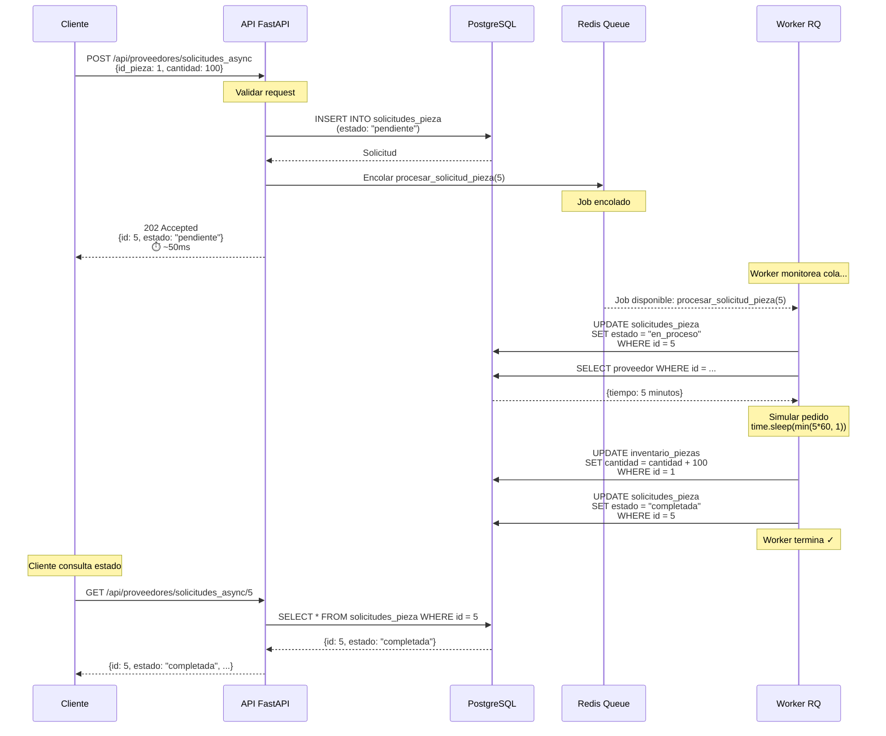
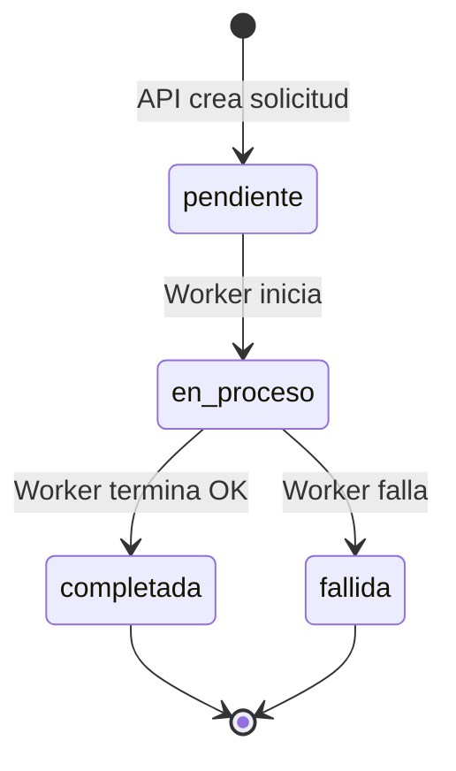
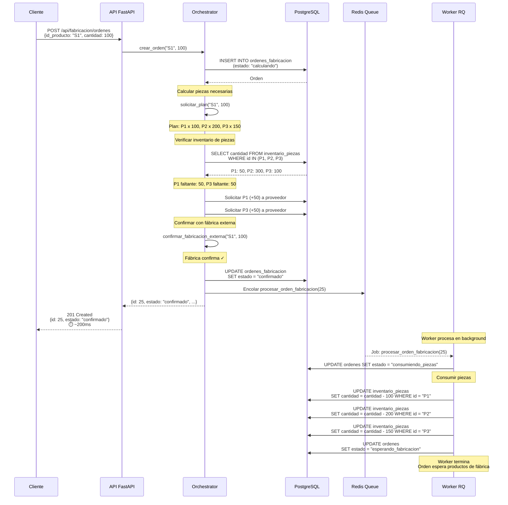
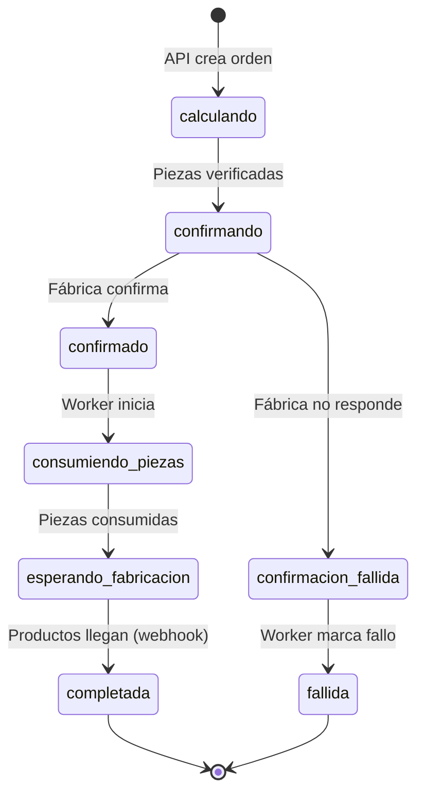
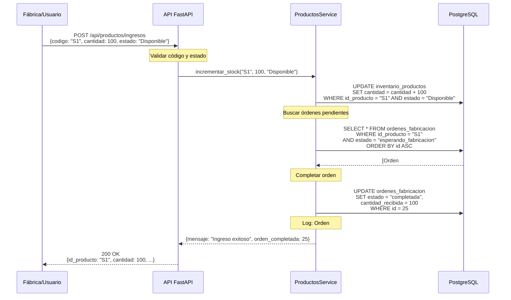
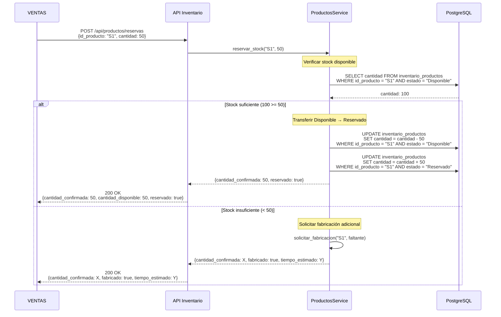
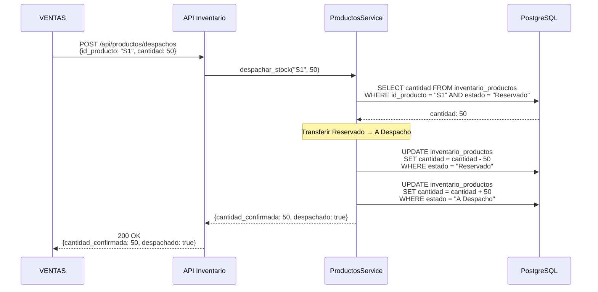
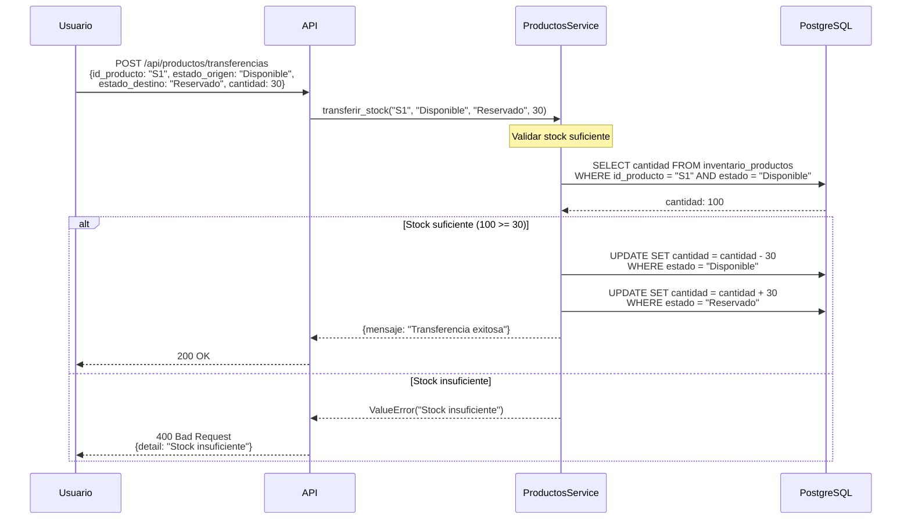

# 📊 Flujos de Inventario

## Introducción

Este documento describe los **flujos de negocio** del sistema de inventario con diagramas de secuencia detallados. Cada flujo muestra cómo interactúan los componentes (API, Workers, Redis, PostgreSQL) para completar una operación.

## Índice de Flujos

1. [Flujo 1: Solicitud de Pieza Asíncrona](#flujo-1-solicitud-de-pieza-asíncrona)
2. [Flujo 2: Orden de Fabricación](#flujo-2-orden-de-fabricación)
3. [Flujo 3: Ingreso de Productos](#flujo-3-ingreso-de-productos)
4. [Flujo 4: Reserva de Stock (VENTAS)](#flujo-4-reserva-de-stock-ventas)
5. [Flujo 5: Despacho de Productos](#flujo-5-despacho-de-productos)
6. [Flujo 6: Transferencia entre Estados](#flujo-6-transferencia-entre-estados)

---

## Flujo 1: Solicitud de Pieza Asíncrona

### Descripción
Cliente solicita piezas a un proveedor de forma asíncrona. La API responde inmediatamente y un worker procesa la solicitud en background.

### Diagrama de Secuencia



### Estados de la Solicitud



### Código Clave

**Endpoint (API):**
```python
@router.post("/solicitudes_async", status_code=202)
def solicitar_piezas_async(body, db):
    # 1. Crear solicitud
    solicitud = solicitudes_service.create({
        "id_pieza": body.id_pieza,
        "cantidad": body.cantidad,
        "estado": "pendiente"
    })
    
    # 2. Encolar worker
    queue.enqueue(procesar_solicitud_pieza, solicitud.id)
    
    # 3. Responder inmediatamente
    return {"id": solicitud.id, "estado": "pendiente"}
```

**Worker:**
```python
def procesar_solicitud_pieza(solicitud_id):
    # 1. Cambiar a "en_proceso"
    solicitud.estado = "en_proceso"
    session.commit()
    
    # 2. Simular pedido a proveedor
    tiempo = proveedor.tiempo
    time.sleep(min(tiempo, 1))
    
    # 3. Incrementar inventario
    pieza.cantidad += solicitud.cantidad
    solicitud.estado = "completada"
    session.commit()
```

### Ejemplo de Uso

```bash
# 1. Solicitar piezas
curl -X POST http://localhost:5050/api/proveedores/solicitudes_async \
  -H "Content-Type: application/json" \
  -d '{"id_pieza": 1, "cantidad": 100}'

# Respuesta inmediata:
# {"id": 5, "estado": "pendiente", "tiempo_estimado": 0}

# 2. Consultar estado (después de unos segundos)
curl http://localhost:5050/api/proveedores/solicitudes_async/5

# Respuesta:
# {"id": 5, "id_pieza": 1, "cantidad": 100, "estado": "completada"}
```

---

## Flujo 2: Orden de Fabricación

### Descripción
Cliente crea una orden de fabricación. El sistema calcula piezas necesarias, solicita las faltantes a proveedores, confirma con fábrica externa y encola un worker para consumir piezas.

### Diagrama de Secuencia



### Estados de la Orden



### Código Clave

**Orchestrator:**
```python
def crear_orden(self, codigo, cantidad):
    # 1. Crear orden
    orden = self.ordenes_service.create({
        "id_producto": codigo,
        "cantidad": cantidad,
        "estado": "calculando"
    })
    
    # 2. Calcular piezas
    plan = self.fabricacion_service.solicitar_plan(codigo, cantidad)
    
    # 3. Solicitar piezas faltantes
    for material in plan.materiales:
        if disponible < necesario:
            self.proveedores_service.solicitar_piezas(...)
    
    # 4. Confirmar con fábrica
    confirmacion = self.fabricacion_service.confirmar_fabricacion_externa(...)
    
    if confirmacion["status"] == "ok":
        orden.estado = "confirmado"
        # 5. Encolar worker
        queue.enqueue(procesar_orden_fabricacion, orden.id)
    
    return {"id": orden.id, "estado": orden.estado}
```

**Worker:**
```python
def procesar_orden_fabricacion(orden_id):
    orden = obtener_orden(orden_id)
    
    # 1. Validar estado
    if orden.estado == "confirmado":
        orden.estado = "consumiendo_piezas"
        session.commit()
        
        # 2. Obtener plan
        plan = fabricacion_service.solicitar_plan(orden.id_producto, orden.cantidad)
        
        # 3. Consumir piezas
        for material in plan.materiales:
            pieza.cantidad -= material["cantidad"]
        session.commit()
        
        # 4. Esperar productos
        orden.estado = "esperando_fabricacion"
        session.commit()
```

---

## Flujo 3: Ingreso de Productos

### Descripción
Productos terminados ingresan al inventario (ya sea manualmente o por webhook de fábrica). El sistema incrementa el inventario y completa órdenes pendientes automáticamente.

### Diagrama de Secuencia



### Lógica de Completar Órdenes

```python
def incrementar_stock(codigo, cantidad, estado):
    # 1. Incrementar inventario
    producto.cantidad += cantidad
    
    # 2. Buscar órdenes pendientes
    ordenes = session.query(OrdenFabricacion)\
        .filter_by(id_producto=codigo, estado="esperando_fabricacion")\
        .order_by(OrdenFabricacion.id.asc())\
        .all()
    
    # 3. Completar órdenes
    cantidad_disponible = cantidad
    for orden in ordenes:
        faltante = orden.cantidad - orden.cantidad_recibida
        
        if cantidad_disponible >= faltante:
            # Completar orden completa
            orden.cantidad_recibida = orden.cantidad
            orden.estado = "completada"
            cantidad_disponible -= faltante
            print(f"[INGRESO] ✓ Orden #{orden.id} completada")
        else:
            # Completar parcialmente
            orden.cantidad_recibida += cantidad_disponible
            cantidad_disponible = 0
            break
    
    session.commit()
```

---

## Flujo 4: Reserva de Stock (VENTAS)

### Descripción  
El módulo de VENTAS solicita reservar stock. El sistema verifica disponibilidad y mueve productos de `Disponible` → `Reservado`.

### Diagrama de Secuencia



### Validación de Stock Mínimo

Después de reservar, el sistema verifica si `Disponible` cayó por debajo del umbral (500 unidades):

```python
def _verificar_stock_minimo_async(codigo):
    disponible = obtener_cantidad_disponible(codigo)
    
    if disponible < 500:  # Umbral mínimo
        # Calcular cuánto producir para llegar a 1000
        cantidad_a_producir = max(1000 - disponible, 500)
        
        # Crear orden de fabricación
        crear_orden_fabricacion(codigo, cantidad_a_producir)
```

---

## Flujo 5: Despacho de Productos

### Descripción
VENTAS confirma una venta. El sistema mueve productos de `Reservado` → `A Despacho`.

### Diagrama



---

## Flujo 6: Transferencia entre Estados

### Descripción
Transferencia manual de stock entre cualquier par de estados.

### Diagrama



---

## Resumen de Flujos

| Flujo | Tipo | Tiempo de Respuesta | Procesamiento |
|-------|------|---------------------|---------------|
| Solicitud de pieza async | Asíncrono | ~50ms | Worker background |
| Orden de fabricación | Asíncrono | ~200ms | Worker background |
| Ingreso de productos | Síncrono | ~100ms | Inmediato |
| Reserva de stock | Síncrono | ~50ms | Inmediato (+ async si fabrica) |
| Despacho | Síncrono | ~50ms | Inmediato |
| Transferencia | Síncrono | ~50ms | Inmediato |

## Convenciones de Estados

### Productos
- **Disponible**: Stock listo para vender
- **Reservado**: Stock apartado para venta (temporal)
- **A Despacho**: Stock confirmado para envío

### Solicitudes de Pieza
- **pendiente**: Creada, esperando worker
- **en_proceso**: Worker procesando
- **completada**: Pieza recibida ✓
- **fallida**: Error en procesamiento ✗

### Órdenes de Fabricación
- **calculando**: Calculando piezas necesarias
- **confirmando**: Contactando fábrica
- **confirmado**: Fábrica aceptó orden
- **consumiendo_piezas**: Worker consumiendo materiales
- **esperando_fabricacion**: Esperando productos de fábrica
- **completada**: Productos recibidos ✓
- **fallida**: Error ✗

## Siguientes Pasos

Ahora que conoces los flujos:

1. **Aprende a desarrollar:** Lee [05_GUIA_DESARROLLO.md](05_GUIA_DESARROLLO.md)
2. **Prueba los flujos:** Lee [TESTING.md](TESTING.md)
